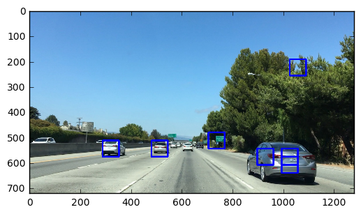
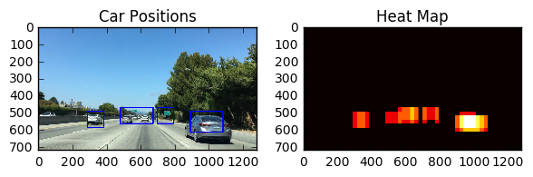
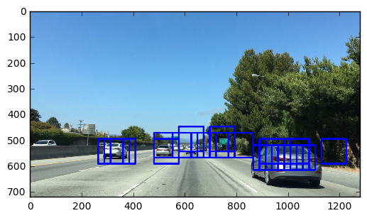

## Vehicle Detector : Vehicle detection in video frames. 
### Preet Singh
This repository contains my work on Udacity’s Vehicle Detection project in their Self-Driving Car program. The problem being solved is detecting vehicles in a dashboard-cam video of the road. The notebook **vehicle-detection-P5.ipynb** and python file **hog_helper_functions.py** contain the code for a object-detection pipeline, specifically vehicles in this application. However, the pipeline can be generalized for any object detection (provided you have object-image data for training the classifier). 

The solution implements a variant of the 2005 Dalal & Triggs paper [***Histogram of Oriented Gradients for Human Detection***](http://lear.inrialpes.fr/people/triggs/pubs/Dalal-cvpr05.pdf). The pipeline has two stages:

#### (1) Training the classifier
(Images of) vehicles (or any other objects) are identified by their frequency signatures of various features - 
the main one being _oriented gradients_ : Gradients of pixel values are taken and binned across an orientation angle range. The magnitude and orientation of the gradients determine the values of each bin, and the subsequent frequency signature. Based on HOG and other frequency-signature features, we train our binary classifier. I’ve used Linear SVM, as Dalal & Triggs have (refer to the paper for an explanation why Linear SVM is an excellent fit for HOG data), but feel free to substitute other classifiers. 

#### (2) Detecting objects
From an input dashboard-camera video stream, the pipeline extracts frames or images, and runs windows or portions of these images through the classifier to identify vehicles. A bounding box is drawn around them, and finally written to an output video.  

**Tech stack:** Python 3, OpenCV, scikit-learn

### Getting started
The data input provided is project_video.mp4, which is a dashboard-cam video from a car, or you can use your own video file. Instructions and code for processing the video through the pipeline are given in the notebook. Training the binary classifier requires a set of images of [vehicles](https://s3.amazonaws.com/udacity-sdc/Vehicle_Tracking/vehicles.zip) vs [non-vehicles](https://s3.amazonaws.com/udacity-sdc/Vehicle_Tracking/non-vehicles.zip) (or chosen_object vs non-chosen_object). The data is a culled version from the GTI and KITTI image sets. The rest of this README provides a summary of the pipeline:

#### Other notes
* Udacity recently released a [larger dataset](https://github.com/udacity/self-driving-car/tree/master/annotations).

* The model has a tendency to skew towards false positives, so I’ve implemented a voting paradigm for each detection. Depending on your application, you may choose to fine-tune this. 

* The initial tests post-classifier training uses a fixed-window search of (64,64) with a 50% overlap in each dimension. 

#### Example of a processed image

### Final pipeline iteration 
Specified in the function **vehicle_det_pipeline_v2**. 

* **find_cars** — per image: creates hog, spatial, color-histogram features, scales them, classifies patches or windows within image, bounds them with a box. 
* **add_heat** — Add += 1 for all pixels inside each bounding box.
* **apply_threshold** & **label** — Zero out pixels below the threshold, labels a number to each of the regions (bounding box, or patch where a car is found) in our image. It has two outputs: The number of regions and an array with the same shape as the input with the different regions numbered.
* **draw_labeled_bboxes** — for each of the car-found regions, identifies a single all-encapsulating bounding box for that region. Also, does a check for false positives.

#### Visual representation of a heat map on our test image

#### False positives 
The models has a tendency to skew heavily towards false positives. To take care of these, I’ve implemented a simple voting paradigm: The bounding box is only added or drawn, if there is a previous ‘vote’ for the bounding box. The functions **is_true_positive** and **is_approx_equal** implement this check for false positives. They compare the currently-found bounding box with all bounding boxes found in the previous frame. If the current box is approximately equal (defined here to be within a finite offset of 50 pixels for each of the box’s defining points), then it’s allowed to be drawn, else it isn’t added. 

#### Final image from find_cars

